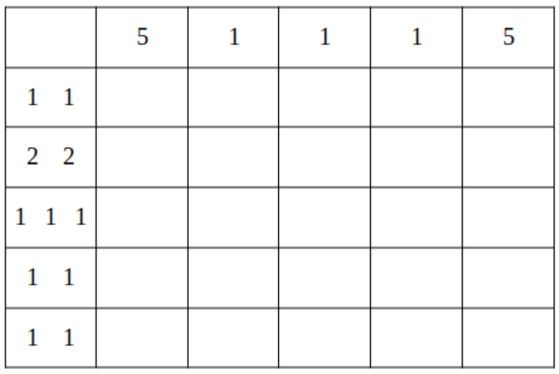
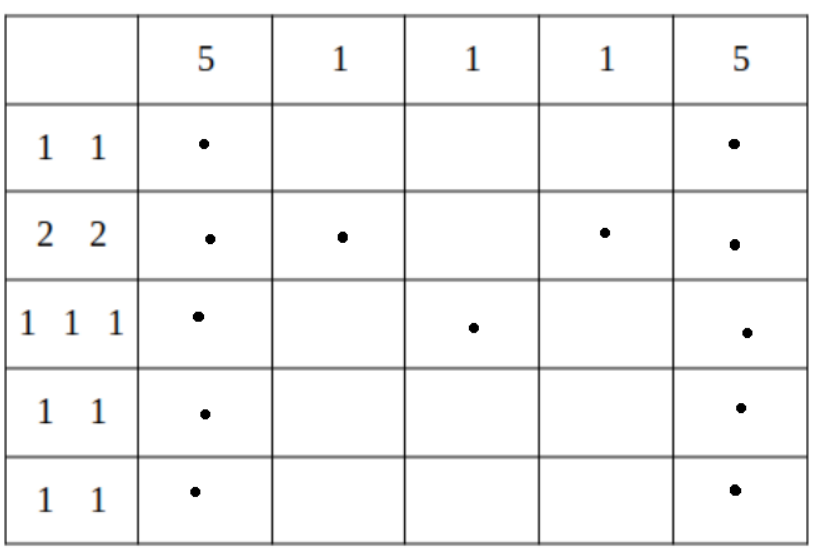
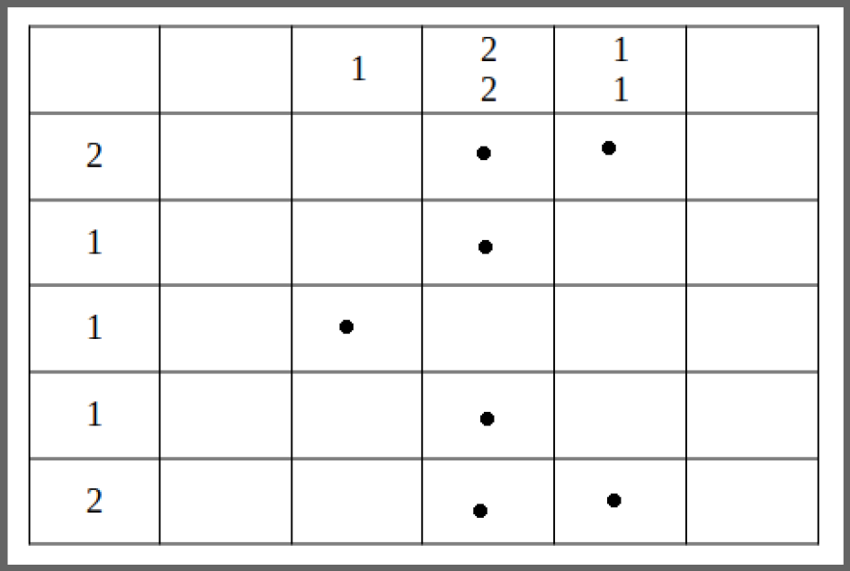

# Approximate write-up for Math puzzle

We are given a zip and its password, encoded.

Inside the zip is another zip, along a `file1.png`. The PNG is broken but if we look
inside we can see at the end a password ; it unlocks the zip.

Inside is again a PNG, `file2.png` and a zip file. PNG broken, password at the end, same thing.

This goes on for about 40 nested zips. The password are encoded using various methods:

binary, bytes, hexadecimal, base32,64,58,85, morse code, letters reversed, rot13...

[CyberChef](https://gchq.github.io/CyberChef/) and its Magic tool were useful

when not obvious it's hinted before `"password:"`, for instance when it's bytes it's `bytespassword`,
for rot13 or rot with another offset: `rotpassword`.

Notably: `VRCA9ZfSF2Zf|aRZEtmR` was actually Base85 **but with the IPv6** standard, giving `arjunisanonymous`.

The PNG are easy to fix. Two things are wrong: the PNG signature was replaced, with some "jpeg" garbage
and the names of the `IHDR` and `IDAT` chunks were exchanged.

The correct hexadecimal signature for a PNG file is `89 50 4e 47 0d 0a 1a 0a`.

A teammate wrote a little node script to automate the fix on the PNG:

```javascript
#!/usr/bin/env node

const fs = require("fs");
let file = fs.readFileSync(process.argv[2]);

const replace = (buf, a, b) => {
  if (!Buffer.isBuffer(buf)) buf = Buffer(buf);
  const idx = buf.indexOf(a);
  if (idx === -1) return buf;
  if (!Buffer.isBuffer(b)) b = Buffer(b);

  const before = buf.slice(0, idx);
  const after = buf.slice(idx + a.length);
  const len = idx + b.length + after.length;
  return Buffer.concat([ before, b, after ], len);
}

let start = 0;

while (file[start] !== 0) {
    start++;
}

file = file.slice(start);

const IHDR = Buffer.from([0x49, 0x48, 0x44, 0x52]);
const IDAT = Buffer.from([0x49, 0x44, 0x41, 0x54]);

file = replace(file, IHDR, IDAT);
file = replace(file, IDAT, IHDR);

process.stdout.write(Buffer.from([0x89, 0x50, 0x4e, 0x47, 0x0d, 0x0a, 0x1a, 0x0a]));
process.stdout.write(file);
```

The script failed for `flag5.png` and partially failed for `flag1.png`, but we did not really
try to fix these.

The PNG are all 6x6 grids with the first line and first column filled with integers. I first noticed that the sum
of the integers on the line and on the column were equal.



The integers actually tell us how we must fill the cells. (In my case I only put a dot).
A cell can be filled or left empty. At first I thought we only used the sum of integers to determine the number
of filled cells in this direction, but the integers are actually the number of juxtaposed filled cells in the direction.
We then have to fill them respecting rules, a bit like in a sudoku.

For example here: it forms a `M`



the grid were each a representation of the characters making the flag, including `zh3r0{` and `}`

The curly brace was hard to tell:



by taking all the characters in the order we got them, we could create the flag, in capital letters except for the wrapping:

`zh3r0{NONOGRAM_IS_AN_INTERESTING_PUZZLE}`
